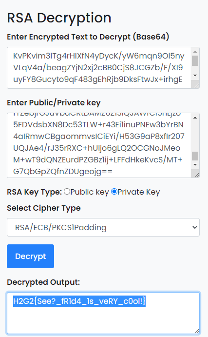

# Jankenpon
**Category: Android Reverse Engineering**

A game this time around! Launching the app we are presented with a classic game of rock paper scissors against an AI opponent:

</img>

If you pick something, the AI player's choice is revealed, and its choice always _just so happens_ to beat yours every time:

</img>

Let's take a look at the decompiled source:

```java
// GameActivity.java
public void play(int input) {
    int bot;
    if (input == this.ROCK) {
        bot = this.PAPER;
    } else if (input == this.PAPER) {
        bot = this.CISORS;
    } else {
        bot = this.ROCK;
    }
    Intent i = new Intent(getApplicationContext(), PlayActivity.class);
    i.putExtra("player", input);
    i.putExtra("bot", bot);
    startActivity(i);
}
```

Well, there's some proof that the bot is straight up cheating. 

I looked at the PlayActivity that the above snippet calls, and it has the handling for what to do after each round:

```java
// PlayActivity.java
public void checkWin(int player, int bot) {
    if (player == bot) {
        draw();
    } else if ((player == 0 && bot == 1) || ((player == 1 && bot == 2) || (player == 2 && bot == 0))) {
        win();
    } else {
        loose();
    }
}

public void draw() {
    this.end.setText(R.string.draw);
    end();
}

public void loose() {
    this.end.setText(R.string.loose);
    end();
}

public void win() {
    this.end.setText(R.string.win);
    String a = "";
    try {
        a = A.decrypt(A.encryptedFlag, A.privateKey);
    } catch (Exception e) {
        System.out.println(e);
    }
    Log.d("CTF", a);
    end();
}
```

Naturally, we go to `loose()` every time since the AI is cheating. But it is interesting to see that code exists to handle a player win, and that it decrypts and logs the value of the flag. Perhaps we can reverse engineer the decryption.

Let's take a look at the `A` class which handles the decryption:

```java
// A.java
public class A {
    public static String encryptedFlag = "KvPKvim3lTg4rHIXfN4yDycK/yW6mqn9Ol5nyVLqV4a/beagZYjN2xj2cBB0CjS8JCGZb/F/XI9uyFY8Gucyto9qF483gEhRjb9DksFtwJx+irhgEVehrx8TbC3MJ1E2S56eAacJkNGoPpBrKVXj4dz+SReBX3A2935QxN08Bcg=";
    public static String privateKey = B.a("AoGBAKOI6d5LmStN9U/fYfzzLNCFwxQGEeatK1eE+sktkdIR85L5H4nV8DZbh2w6puCRjuWRa9U3J0iH", "cJAgMBAAECgYAcS1UDZBsVNgDKmACxLjXDwlD1RvOT8MQ9+UEWy66eJQL6m+XMCFruXLm6jQ9QbX7G03lPw6I", "aommvsICiEYi/H53G9aP8xfIr207UQJAe4/rJ35rRXC+hUljo6gLQ2OCGNoJMeoM+wT9dQNZEurdPZGBz1ij+LFFdHkeKvcS/MT+G7QbGpZQfnZDUgeojg==", "yKizuHpAkEA4GqH0htOFrIMTUMdpamd6X9OP+r9hakd5gymmcWc6lmP14DKkwTw5Gchqs0ZfTZebjrGJuVbaCRtDAMZ6Z13IQJAWfCl5nLjzo5FDVdsbXN8Dc53TLW+r43Ei1inuPNEw3bYrBN4aIRmwCBg", "fd7dMBF8KjsjfK3MxV10ojNzfPwvd8yokrFC59vit4ym0KXy61e/ZpgTu7cUAUdmganH7m7K0vrN+cR9siOMiTY3mBGt0G", "MIICdgIBADANBgkqhkiG9w0BAQEFAASCAmAwggJcAgEA", "qBpVt+M8+68zIdtbICU3LmNly8tYIYqMwsZEgtHyZkCdSV1rzBLq9cpx+or2naLzzADONj5AZUBLWmCCECQQCnN45oya3UPL1uDttyhxAPLqWxdRSIcxD80+kP/AhbaplCEw9htuBw/y0QCTBimZhHwepgiuIrEE9RS", "lV2P8ylJFxDDeEE7qBXObET7d4sKkj49hc2kh3Q8/Cs6SB1bb7vA8k2wgoNZXZgOWrGstoCZZ3nFCvBasuPTCTUo/XBcKHEifAQJBAPpc3b");

...

    public static String decrypt(byte[] data, PrivateKey privateKey2) throws NoSuchPaddingException, NoSuchAlgorithmException, InvalidKeyException, BadPaddingException, IllegalBlockSizeException {
        Cipher cipher = Cipher.getInstance("RSA/ECB/PKCS1Padding");
        cipher.init(2, privateKey2);
        return new String(cipher.doFinal(data));
    }

    public static String decrypt(String data, String base64PrivateKey) throws IllegalBlockSizeException, InvalidKeyException, BadPaddingException, NoSuchAlgorithmException, NoSuchPaddingException {
        return decrypt(Base64.getDecoder().decode(data.getBytes()), getPrivateKey(base64PrivateKey));
    }
}
```

There are a couple of things to note:
1. We have the `encryptedFlag`
2. We can see the encryption method is `RSA/ECB/PKCS1Padding`

It looks like there is some strange processing going on with the `privateKey`, but if we can work that out we should have all we need to find the flag.

Class `B` has a function `a` which is used to calculate the `privateKey`. Let's take a look:
```java
public class B {
    public static String a(String a, String b, String c, String d, String e, String f, String g, String h) {
        ArrayList<String> aa = C.a(f, a, g, "");
        String str = aa.get(0);
        String str2 = aa.get(3);
        String str3 = aa.get(1);
        String str4 = aa.get(2);
        String v = "".concat(f);
        String y = a.concat(e);
        return "".concat(v.concat(y)).concat(b.concat(h).concat(g.concat(d))).concat(c);
    }
}
```

Ok, that's pretty weird. Looks like it is just obfuscating what the key is. This class is also calling a `C.a` function:

```java
public class C {
    public static ArrayList<String> a(String a, String b, String c, String d) {
        ArrayList<String> aa = new ArrayList<>();
        aa.add("Bh6ZriuhZ===".concat(a));
        aa.add(b.concat("niDAZe8="));
        aa.add("BoazBIQZD89N+QZOINnqzdnnQZBBa");
        aa.add(d.concat(c));
        return aa;
    }
}
```

More nonsense, essentially. Still, we can put these functions together in a new program to figure out what the `privateKey` is:

```java
public class Exploit{
    public static String encryptedFlag = "KvPKvim3lTg4rHIXfN4yDycK/yW6mqn9Ol5nyVLqV4a/beagZYjN2xj2cBB0CjS8JCGZb/F/XI9uyFY8Gucyto9qF483gEhRjb9DksFtwJx+irhgEVehrx8TbC3MJ1E2S56eAacJkNGoPpBrKVXj4dz+SReBX3A2935QxN08Bcg=";
    public static String privateKey = B.a("AoGBAKOI6d5LmStN9U/fYfzzLNCFwxQGEeatK1eE+sktkdIR85L5H4nV8DZbh2w6puCRjuWRa9U3J0iH", "cJAgMBAAECgYAcS1UDZBsVNgDKmACxLjXDwlD1RvOT8MQ9+UEWy66eJQL6m+XMCFruXLm6jQ9QbX7G03lPw6I", "aommvsICiEYi/H53G9aP8xfIr207UQJAe4/rJ35rRXC+hUljo6gLQ2OCGNoJMeoM+wT9dQNZEurdPZGBz1ij+LFFdHkeKvcS/MT+G7QbGpZQfnZDUgeojg==", "yKizuHpAkEA4GqH0htOFrIMTUMdpamd6X9OP+r9hakd5gymmcWc6lmP14DKkwTw5Gchqs0ZfTZebjrGJuVbaCRtDAMZ6Z13IQJAWfCl5nLjzo5FDVdsbXN8Dc53TLW+r43Ei1inuPNEw3bYrBN4aIRmwCBg", "fd7dMBF8KjsjfK3MxV10ojNzfPwvd8yokrFC59vit4ym0KXy61e/ZpgTu7cUAUdmganH7m7K0vrN+cR9siOMiTY3mBGt0G", "MIICdgIBADANBgkqhkiG9w0BAQEFAASCAmAwggJcAgEA", "qBpVt+M8+68zIdtbICU3LmNly8tYIYqMwsZEgtHyZkCdSV1rzBLq9cpx+or2naLzzADONj5AZUBLWmCCECQQCnN45oya3UPL1uDttyhxAPLqWxdRSIcxD80+kP/AhbaplCEw9htuBw/y0QCTBimZhHwepgiuIrEE9RS", "lV2P8ylJFxDDeEE7qBXObET7d4sKkj49hc2kh3Q8/Cs6SB1bb7vA8k2wgoNZXZgOWrGstoCZZ3nFCvBasuPTCTUo/XBcKHEifAQJBAPpc3b");


    public static void main(String []args){
       System.out.println(privateKey);
    }
}

class B {
    public static String a(String a, String b, String c, String d, String e, String f, String g, String h) {
        ArrayList<String> aa = C.a(f, a, g, "");
        String str = aa.get(0);
        String str2 = aa.get(3);
        String str3 = aa.get(1);
        String str4 = aa.get(2);
        String v = "".concat(f);
        String y = a.concat(e);
        return "".concat(v.concat(y)).concat(b.concat(h).concat(g.concat(d))).concat(c);
    }
}
class C {
    public static ArrayList<String> a(String a, String b, String c, String d) {
        ArrayList<String> aa = new ArrayList<>();
        aa.add("Bh6ZriuhZ===".concat(a));
        aa.add(b.concat("niDAZe8="));
        aa.add("BoazBIQZD89N+QZOINnqzdnnQZBBa");
        aa.add(d.concat(c));
        return aa;
    }
}
```

Running this mini program prints us the private key: 
```
MIICdgIBADANBgkqhkiG9w0BAQEFAASCAmAwggJcAgEAAoGBAKOI6d5LmStN9U/fYfzzLNCFwxQGEeatK1eE+sktkdIR85L5H4nV8DZbh2w6puCRjuWRa9U3J0iHfd7dMBF8KjsjfK3MxV10ojNzfPwvd8yokrFC59vit4ym0KXy61e/ZpgTu7cUAUdmganH7m7K0vrN+cR9siOMiTY3mBGt0GcJAgMBAAECgYAcS1UDZBsVNgDKmACxLjXDwlD1RvOT8MQ9+UEWy66eJQL6m+XMCFruXLm6jQ9QbX7G03lPw6IlV2P8ylJFxDDeEE7qBXObET7d4sKkj49hc2kh3Q8/Cs6SB1bb7vA8k2wgoNZXZgOWrGstoCZZ3nFCvBasuPTCTUo/XBcKHEifAQJBAPpc3bqBpVt+M8+68zIdtbICU3LmNly8tYIYqMwsZEgtHyZkCdSV1rzBLq9cpx+or2naLzzADONj5AZUBLWmCCECQQCnN45oya3UPL1uDttyhxAPLqWxdRSIcxD80+kP/AhbaplCEw9htuBw/y0QCTBimZhHwepgiuIrEE9RSyKizuHpAkEA4GqH0htOFrIMTUMdpamd6X9OP+r9hakd5gymmcWc6lmP14DKkwTw5Gchqs0ZfTZebjrGJuVbaCRtDAMZ6Z13IQJAWfCl5nLjzo5FDVdsbXN8Dc53TLW+r43Ei1inuPNEw3bYrBN4aIRmwCBgaommvsICiEYi/H53G9aP8xfIr207UQJAe4/rJ35rRXC+hUljo6gLQ2OCGNoJMeoM+wT9dQNZEurdPZGBz1ij+LFFdHkeKvcS/MT+G7QbGpZQfnZDUgeojg==
```

Next, we can just decrypt the `encryptedFlag` with the `privateKey`:



`H2G2{See?_fR1d4_1s_veRY_c0ol!}`
